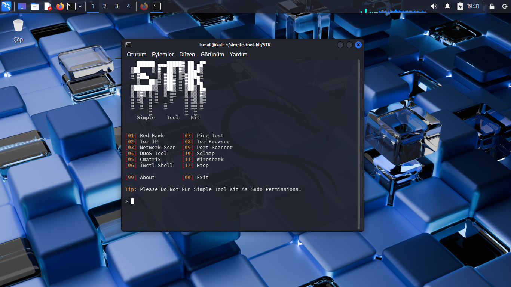

```markdown
# 🛡️ Simple Tool Kit – Yeni Başlayanlar için Siber Güvenlik Aracı

**Simple Tool Kit**, etik korsanlık ve ağ güvenliği alanına yeni adım atanların ilk deneyimlerini güvenli bir şekilde yaşamalarına yardımcı olmak üzere tasarlanmış, hafif ve yeni başlayanlara uygun bir siber güvenlik araç setidir. Karmaşık araçların tersine, bu paket öğrenmeyi ve pratik yapmayı kolaylaştıracak temel araçları içerir.

## 👥 Hedef Kitle

Bu araç seti şu kişiler için idealdir:

- Siber güvenliğe yeni başlayan öğrenciler ve meraklılar  
- Temel Linux/terminal becerilerine sahip olup güvenlik araçlarını keşfetmek isteyenler  
- Güvenli, çevrimdışı (offline) ortamda pratik yapmak isteyen öz öğreniciler veya hobilerle ilgilenenler  
- Etik korsanlık temellerini öğreten eğitmenler veya rehberler

## 🧰 İçindekiler

Araç seti, temel fakat önemli birkaç siber güvenlik aracını içerir:

- IP ve domain port tarayıcı,
- DDoS Aracı,
- DNS ve HTTP başlık analizleri ile whois tarayıcısı (Üçü Bir Arada),
- Tor IP Aracı vb.
- SQL enjeksiyon aracı (Sqlmap)

> %85 civarı Python ve %14 civarı Shell kullanılarak oluşturulmuştur; bu sayede taşınabilirlik ve script uyumluluğu sağlanır.

## 🔍 Neden Bu Proje?

Siber güvenliğe başlamak göz korkutucu olabilir.
Çoğu güçlü araç karmaşıktır veya ön bilgi gerektirir.
Simple Tool Kit, öğrenme ile uygulamayı birleştirerek
keşfetmek isteyenler için güvenli bir başlangıç alanı sunar.

## 🛠️ Nasıl Kullanılır

1. Depoyu klonlayın:
   ```bash
   git clone https://github.com/ctrl-alt-del-2010-developer/simple-tool-kit.git
   cd simple-tool-kit
   cd STK
   ```

2. Bağımlılıkları yükleyin:
   ```bash
   sudo bash setup.sh
   ```

3. Araç setini çalıştırın (Not: Bu script'i root izinleriyle çalıştırmayın):
   ```bash
   bash run.sh
   ```
## Ve Sonuç!


4. Menüden bir araç seçin — her bir araç yeni başlayanlar için açıklanmıştır ve kullanımı kolaydır.

## 📁 Proje Yapısı

```
simple-tool-kit/
├── LICENSE
├── STK/
|   ├── ascii.txt
|   ├── README.md
|   ├── requirements.txt
|   ├── setup.sh
|   ├── run.sh
|   └── Programs 
|        ├── port_scanner.py
|        ├── DDoS-tool.py
|        ├── about.txt
|        ├── ip_changer.py
|        └── red_hawk.py
```

## 🚀 Gelecek Planları

- Daha fazla araç eklemek (örn. zafiyet tarayıcıları, parola kırıcılar)  
- Tkinter veya PyQt kullanılarak GUI versiyonu  
- Çoklu dil desteği (İngilizce/Türkçe)  
- Kayıt (logging) ve raporlama özellikleri  
- Eğitim platformu entegrasyonu

## 💻 Eğitsel Değer

Araçları kullanırken "nasıl yapıldıklarını da" öğrenin. Kodlar basit, iyi yorumlanmış ve eğitseldir.

- Siber güvenlik için Python betikleri (scripting) öğrenin  
- Komut satırı aracılığıyla ağ etkileşimlerini anlayın  
- Bash ve Python'u etkili biçimde birleştirmeyi öğrenin

## 🧠 Felsefe

> İnşa ederek öğren. Kullanarak öğren.

Bu araç seti bir başlangıç noktasıdır — daha büyük, gelişmiş araçlara geçiş için bir sıçrama tahtasıdır. Keşif, öğrenme ve etik kullanım amaçlanmıştır.

## 📜 Lisans

MIT Lisansı altında lisanslanmıştır. Kişisel ve eğitsel kullanım için özgürce kullanabilir, değiştirebilir ve dağıtabilirsiniz.

## 🤝 Katkıda Bulunma

Koda yeni misiniz? Harika!

- Yazım hatalarını düzeltin veya README'yi iyileştirin  
- Yeni araçlar ekleyin  
- Hataları bildirin veya özellik talep edin (Issues veya Pull Request'ler aracılığıyla)

Her türlü katkı memnuniyetle karşılanır — küçük katkılar bile değerlidir.

---

🧑‍💻 **Simple Tool Kit**, eğitim amaçlı geliştirilmiştir. Siber güvenliğe ilk adımınızı atmaya hazırsanız burası başlamanız için doğru yer.
🔗 GitHub: https://github.com/ctrl-alt-del-2010-developer/simple-tool-kit
```
